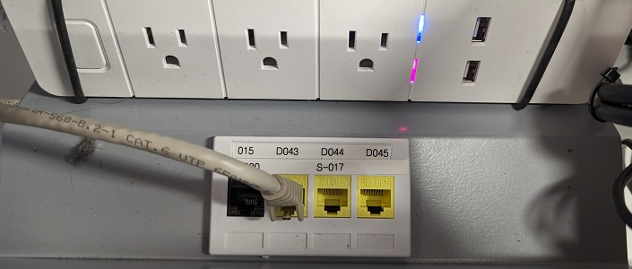
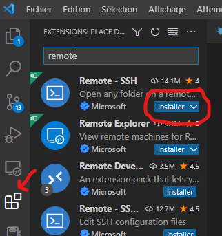
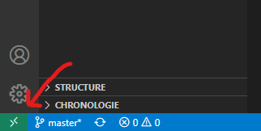
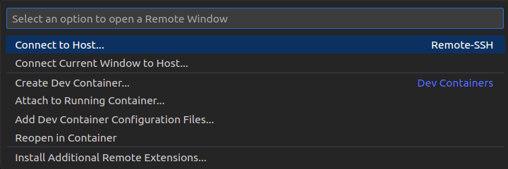
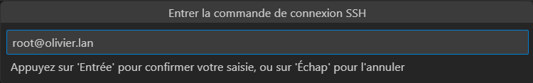
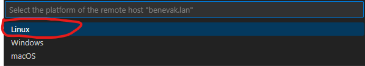
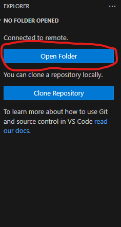
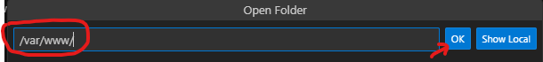
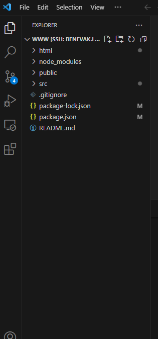
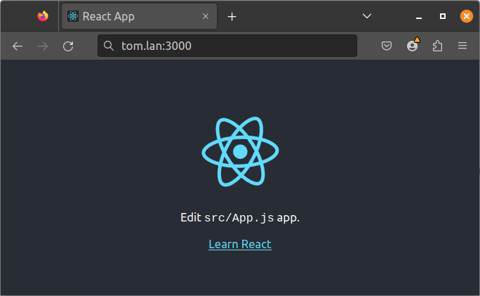

## Utiliser l'environnement distant

Dans ce qui suit nous allons configurer VSCode pour qu’il se connecte directement sur un serveur distant utilisé pour le développement. C’est cette configuration qui est utilisée en classe.

#### Connexion physique

Afin d’accéder à ce serveur de développement, vous devez vous connecter sur le réseau interne du département.

Après avoir ouvert votre session Windows, modifiez la connexion réseau physique de votre poste de travail comme dans l’image qui suit:



Dans ce réseau, vous avez accès à internet, mais les ressources du Collège sont limitées.

> Attention :
> A la fin du cours, n’oubliez pas de rebrancher le câble sur le réseau du Collège!

#### Connexion de VSCode

Votre serveur est identifié par votre nom de famille et de la première lettre de votre prénom, suivi du domaine “.lan”, par exemple benachourg.lan. L’application React de base et la librairie Bootstrap y sont installées. Pour vous connecter au serveur à partir de VSCode pour la première fois, il faut installer l'extension Remote SSH .
Dans l’onglet des extensions, recherchez Remote SSH puis cliquez sur Installer:



Pour ouvrir une connexion, cliquez sur le coin en bas à gauche de la fenêtre:



 Ensuite, vous devez créer la connexion comme suit:



Dans le menu qui apparaît, choisissez `Se connecter à l'hôte` puis entrez l’identifiant de connexion : root@nomDeFamille+PremiereLettreDePrenom.lan : 



Si on vous demande de choisir une plateforme, sélectionnez `Linux` :


Si on vous demande si vous êtes sûr de continuer, sélectionnez `Continue`.

Entrez ensuite votre mot de passe, qui est votre **numéro de DA**.

Si tout se passe comme prévu, vous serez connecté via SSH à votre environnement de développement. L’environnement de développement comprend une instalation de NodeJS, Bootstrap et l’application par défaut (“Hello World”) de React.


Pour avoir accès au dossier du projet React, appuyez sur `Ouvrir dossier` sur la barre de navigation à droite :


Dans la barre qui s'ouvre, écrivez `/var/www/` puis appuyez sur `OK` :



Entrez de nouveau votre mot de passe. Vous êtes sensé voir votre dossier de projet dans la barre de navigation à gauche.



#### Démarrage de l’application React
Pour démarrer l’application, faites les comandes suivantes dans le terminal:

```shell
cd /var/www
npm start
```

> Note : 
>
> L’erreur suivante peut survenir lorsque vous faites npm start:
> `Error: ENOSPC: System limit for number of file watchers reached`
>Si c’est le cas, lancez les commandes suivantes:
>
>```shell
>echo 'fs.inotify.max_user_watches=524288' >> /etc/sysctl.conf
>
> sysctl -p


L’application sera visible au port 3000 du serveur; donc si votre serveur se nomme tom.lan, ouvrez une page à l’adresse http://tom.lan:3000:


